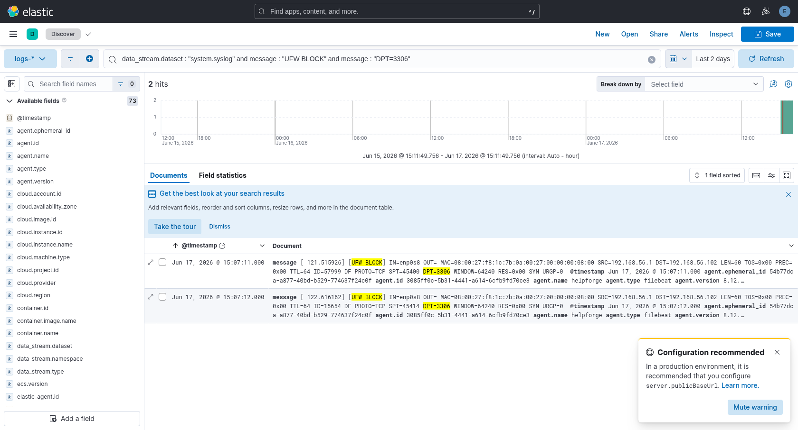
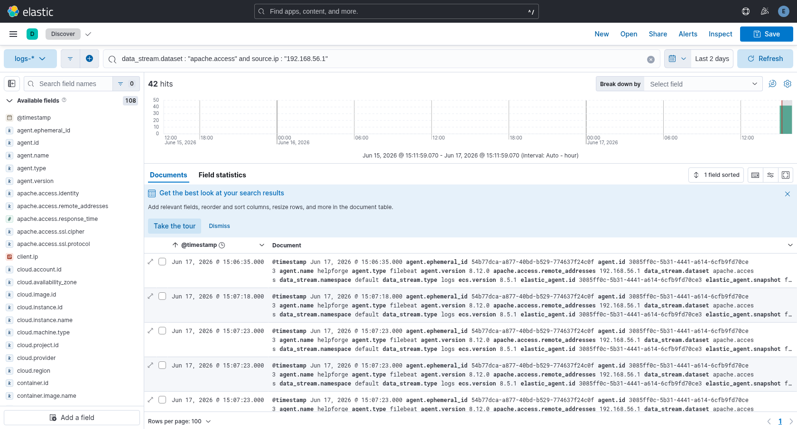
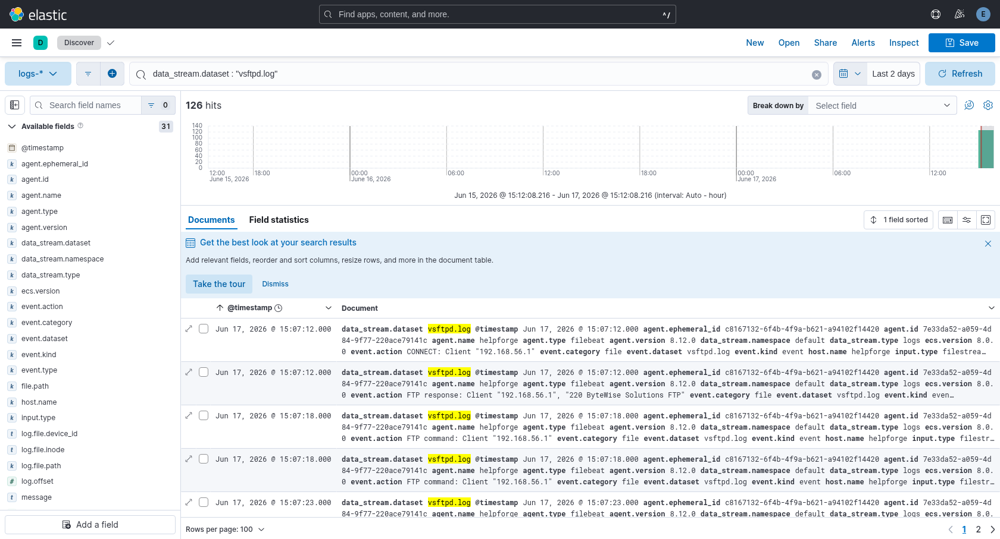
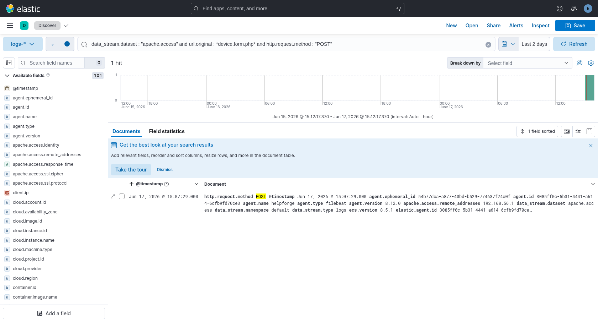
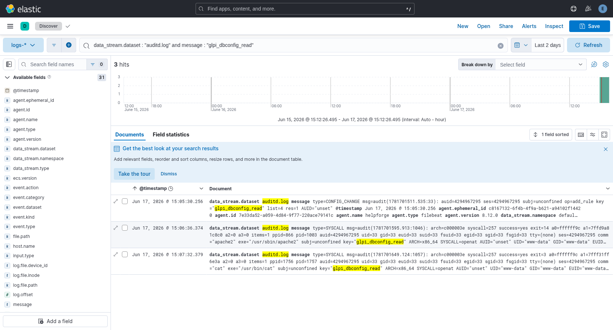
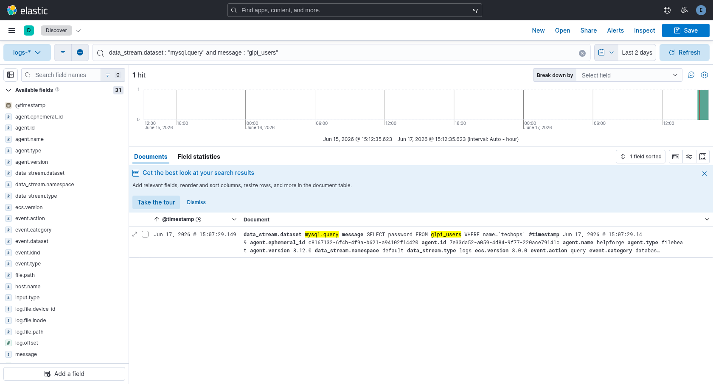
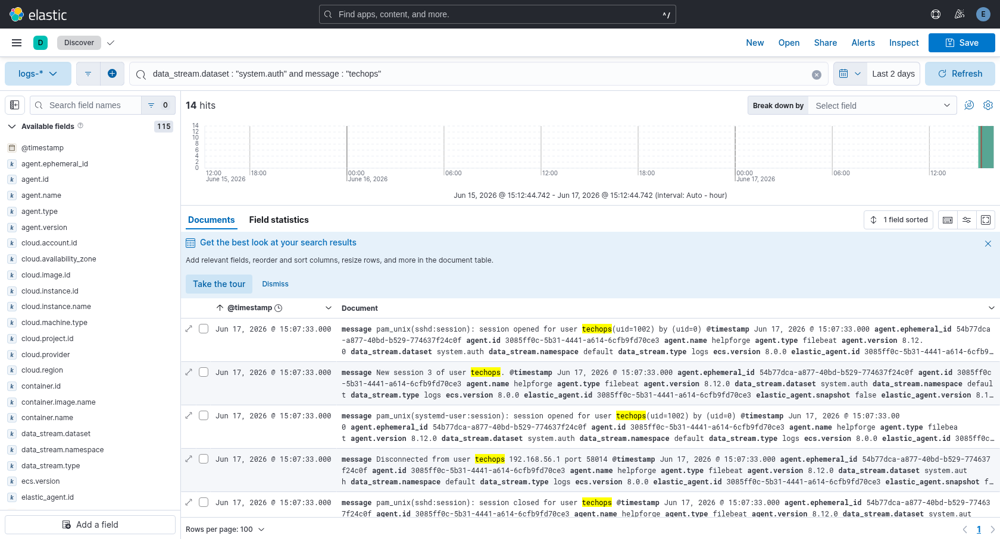
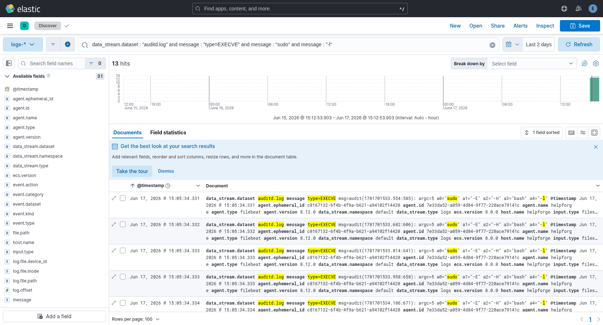
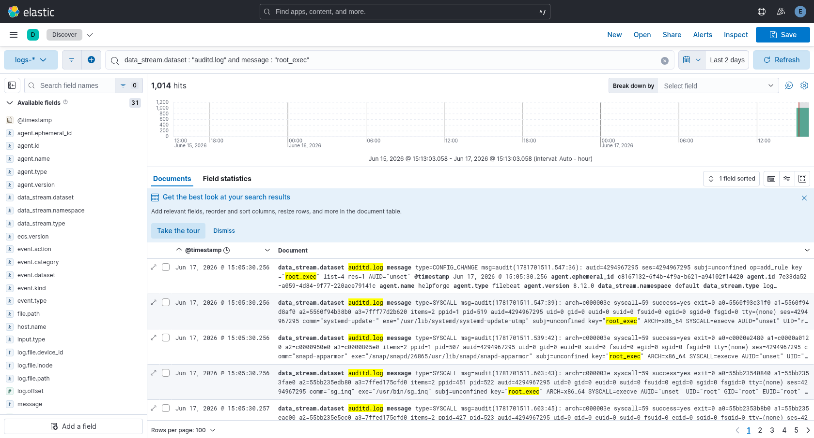
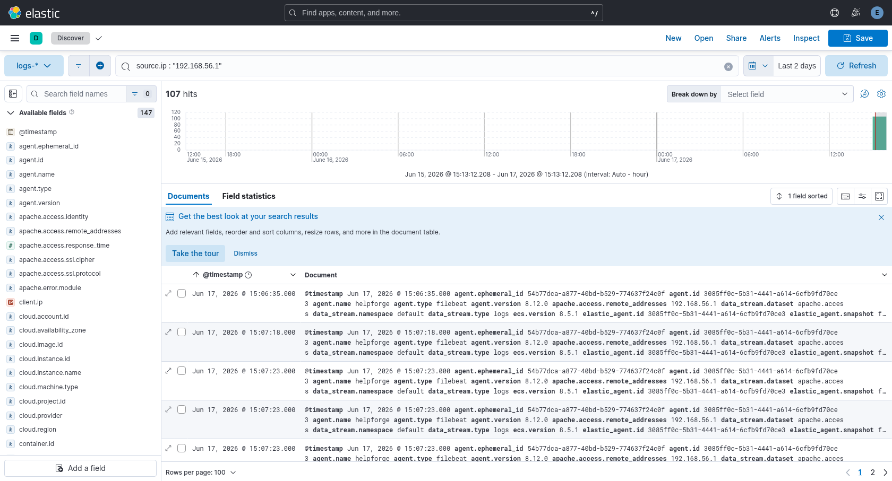

# HelpForge — SIEM Analytics & Detection Writeup (Chapter 8)

**Builder:** Luca Ferroni · **Challenge:** HelpForge (GLPI 10.0.9, `192.168.56.102`)
**SIEM:** Elastic Stack 8.12.0 (`192.168.56.10`), cluster `helpforge-siem`
**Purpose (per assignment):** extend the solution writeup with the *analytics
perspective* — replay the attack on the instrumented machine and document, with
**KQL queries, raw-log evidence and Kibana screenshots**, whether the
instrumentation and detection logic **cover/detect** each attack step.

This is the screenshot-backed companion to `writeup.md` (attack narrative),
`log-completeness-matrix.md` (raw-log gap analysis) and `siem-integration.md`
(architecture + full KQL reference). Screenshots live in `siem-screenshots/`.

---

## 1. Live verification (this run)

Both VMs were booted and the attack replayed end-to-end on **2026-06-17**:

```text
$ cd elastic-stack && python3 scripts/verify_siem.py
=== Stack health ===           [+] Elasticsearch helpforge-siem status=yellow
                               [+] Kibana available
=== ingest pipelines/streams === 13× [+]  (mysql-query-parse, vsftpd-parse,
                                     all logs-*-default data streams present)
=== Fleet ===                  [+] HelpForge agent enrolled status=online
                               [+] integrations system / apache / mysql configured
                               [+] Apache custom access path helpforge-access.log
=== Summary ===                [+] 30 passed   [~] 0 warnings   [!] 0 failed

$ cd helpforge && ./solve.sh 192.168.56.102        # full 10-step replay, 25 s
[*] Foothold: uid=33(www-data) ... [*] Cracked techops password: TechOps_HelpForge24
[*] User flag: FLAG{917b43b3f6ec820a25ed2cb465426259}
[*] Root flag: FLAG{d5a31615c10bb7671aa2f4bbbd161f05}
```

Both Fleet agents (`helpforge`, `elk-server`) report **online**; the verifier's
per-step event counts are all **> 0**, and the fresh replay's events are visible
in Kibana under a *Last 2 days* window (screenshots below). **Detection result:
9 of the 10 steps are directly queryable; step 7 is covered by correlation — the
chain is fully reconstructable in Kibana.**

## 2. Method

- Data view **`logs-*`**, every source filtered uniformly on
  **`data_stream.dataset`** (Fleet Agent sets it natively; the standalone
  Filebeat sets it per input — see `siem-integration.md`).
- Each query below was deep-linked into **Discover** (time range *Last 2 days*,
  sorted `@timestamp` asc) and screenshotted headless. The hit count shown is the
  **fresh-replay** count (the persisted older run sits outside the 2-day window).
- MITRE technique IDs mirror `challenge-design-v1.md` §3.1.

---

## 3. Per-step detection

| # | Step (MITRE) | Source / dataset | KQL | Hits | Detected? |
|---|---|---|---|---|---|
| 1 | nmap recon (T1046) | `system.syslog` (UFW) | `... "UFW BLOCK" and message : "DPT=3306"` | 2 | ✅ |
| 2 | GLPI fingerprint (T1595) | `apache.access` | `... and source.ip : "192.168.56.1"` | 42 | ✅ |
| 3 | FTP enum (T1083) | `vsftpd.log` | `data_stream.dataset : "vsftpd.log"` | 126 | ✅ |
| 4 | **CVE-2023-42802 RCE (T1190/T1505.003)** | `apache.access` | `... url.original : *device.form.php* and http.request.method : "POST"` | 1 | ✅ **KEY** |
| 5 | Read `config_db.php` (T1552.001) | `auditd.log` | `... message : "glpi_dbconfig_read"` | 3 | ✅ |
| 6 | Dump `glpi_users` hash (T1005) | `mysql.query` | `... message : "glpi_users"` | 1 | ✅ |
| 7 | Offline bcrypt crack (T1110.002) | — | *(no target log — by design)* | — | ⛔→corr. |
| 8 | SSH reuse as `techops` (T1078) | `system.auth` | `... message : "techops"` | 14 | ✅ |
| 9 | `sudo -l` recon (T1069.001) | `auditd.log` | `... "type=EXECVE" and "sudo" and "-l"` | 13 | ✅* |
| 10 | `sudo less` → root (T1548.003) | `auditd.log` | `... message : "root_exec"` | 1014 | ✅ |

\* Step 9 is **not** loggable on a vanilla baseline (matrix verdict "No"); the
`audit` role's `-w /usr/bin/sudo -p x` watch makes the `sudo -l` invocation visible
in the EXECVE record (see `siem-integration.md` §"The `sudo -l` blind spot").

### Step 1 — nmap recon, UFW kernel block (T1046)
`data_stream.dataset : "system.syslog" and message : "UFW BLOCK" and message : "DPT=3306"`


### Step 2 — GLPI HTTP fingerprinting (T1595)
`data_stream.dataset : "apache.access" and source.ip : "192.168.56.1"`


### Step 3 — anonymous FTP enumeration / download (T1083)
`data_stream.dataset : "vsftpd.log"` (parsed by the `vsftpd-parse` ingest pipeline)


### Step 4 — CVE-2023-42802 web-shell upload **(KEY EVENT, Milestone 8.15 item 7)**
`data_stream.dataset : "apache.access" and url.original : *device.form.php* and http.request.method : "POST"`
The single `POST /front/device.form.php` (HTTP 200) is the exploitation proof; the
follow-on `GET /front/files/file.png?cmd=...` requests appear under the same
`source.ip` (steps 5–6).


### Step 5 — read `config_db.php`, server-side (T1552.001)
`data_stream.dataset : "auditd.log" and message : "glpi_dbconfig_read"`
auditd file-read watch shipped by the `audit` role (`-w .../config_db.php -p r`).


### Step 6 — dump `glpi_users` bcrypt hash, DB-side (T1005)
`data_stream.dataset : "mysql.query" and message : "glpi_users"`
The MySQL general log captures `SELECT password FROM glpi_users WHERE name='techops'`,
parsed into ECS by the `mysql-query-parse` pipeline.


### Step 7 — offline bcrypt cracking (T1110.002) · **no target log, by design**
The hash is cracked on the attacker host against the FTP wordlist; the target sees
nothing. Covered by **correlation** (§4): it is bracketed by step 6 (hash dump) and
step 8 (successful `techops` login) from the same IP minutes apart.

### Step 8 — SSH password reuse as `techops` (T1078)
`data_stream.dataset : "system.auth" and message : "techops"`


### Step 9 — `sudo -l` enumeration (T1069.001)
`data_stream.dataset : "auditd.log" and message : "type=EXECVE" and message : "sudo" and message : "-l"`


### Step 10 — `sudo less` shell escape → root (T1548.003)
`data_stream.dataset : "auditd.log" and message : "root_exec"`
auditd `-a always,exit -F arch=b64 -S execve -F euid=0` records the root execve.


## 4. Cross-source correlation — the attacker-IP pivot

`source.ip : "192.168.56.1"` — sorted `@timestamp` asc, the **entire kill chain**
appears across syslog → apache.access → vsftpd → auditd → mysql.query →
system.auth in one view. This is what closes the step-7 blind spot: the offline
crack leaves no line, but the hash dump (step 6) and the successful login (step 8)
from the same IP bracket it in time.


## 5. Detection-coverage assessment

| Verdict (vanilla baseline) | Steps | Live result on the **instrumented** VM |
|---|---|---|
| Logged by default | 1, 2, 3, 4, 8, 10 | ✅ queryable |
| Server-side depth via `audit` role | 5, 6 | ✅ queryable (auditd + mysql general log) |
| Not loggable by default | 7, 9 | 7 = correlation only (unavoidable); 9 = closed via `sudo` execve watch |

- **Breadth:** 9/10 steps produce a directly queryable artifact on the delivered
  VM; **10/10 are reconstructable** once correlation covers step 7.
- **Only inherent gap:** step 7 (offline cracking) cannot, in principle, produce a
  target-side log — detection is by correlation, not by a direct artifact.
- This matches and now **visually proves** the `log-completeness-matrix.md` verdicts
  with live Kibana evidence rather than only quoted raw-log lines.

## 6. Reproduction

```bash
# 1. SIEM stack  (writes ./fleet-enrollment-token.txt)
cd elastic-stack && vagrant up
# 2. CTF VM  (Elastic Agent auto-enrolls via the token)
cd ../helpforge && vagrant up
# 3. Health + per-step counts
cd ../elastic-stack && python3 scripts/verify_siem.py
# 4. Replay the full attack chain (generates the events)
cd ../helpforge && ./solve.sh 192.168.56.102
# 5. Kibana → Discover (data view logs-*, Last 2 days) and run the §3 KQL,
#    or regenerate all screenshots headlessly:
python3 /tmp/kbshot.py helpforge/siem-screenshots
```

## 7. Notes / honest caveats

- **Detection = hunting queries + instrumentation**, not automated Detection-Engine
  alert rules. The Chapter 8 scope is "make every attack step queryable in
  Discover"; turning the §3 KQL into saved searches / alert rules is a natural next
  step if auto-alerting is required.
- The persisted older replay (Jun 1) is still in the indices; the *Last 2 days*
  window isolates this run, so screenshot counts are lower than the all-time
  `verify_siem.py` totals — both are correct, different windows.
- When the **cross-solver's** HelpForge writeup arrives, map their exact steps onto
  these same datasets/queries; the canonical 10-step path is already covered.
